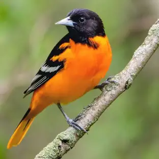

# Classification_of_Animals_Webpage

This is a simple HTML webpage that provides information on five classifications of animals: **birds**, **fish**, **mammals**, **reptiles**, and **amphibians**. The page includes a brief description, an image, and a link to more information for each classification.

## Features
- **5 Classifications of Animals**: 
  - **Birds**: Warm-blooded animals with feathers, beaks, and the ability to lay eggs.
  - **Fish**: Cold-blooded aquatic vertebrates with gills and scales.
  - **Mammals**: Warm-blooded animals that nurse their young and have hair or fur.
  - **Reptiles**: Cold-blooded, scaly animals often found in dry environments.
  - **Amphibians**: Cold-blooded animals that live both in water and on land.
  
- **Clickable Links**: Each section has a link to a Wikipedia page for further reading.
- **Images**: Each classification has a relevant image to help visualize the animal group.
- **Responsive Design**: The page adapts to different screen sizes for easy readability.

## Technologies Used
- **HTML5**: For structuring the webpage.
- **CSS (Inline Styling)**: Used for basic design and layout enhancements.

## Getting Started
To view the webpage, simply open the `index.html` file in any modern web browser. Make sure all the image files are located in the `images` directory.

1. Download or clone the repository.
2. Open the `index.html` file in your browser.

## Code Highlights

Here are some important code snippets:

- **Heading and Styling**:
    ```html
    <h1 style="color: white; background-color: #394ae1; font-size: 2.5em; text-align: center;">
        5 Classifications of Animals
    </h1>
    ```

- **Section Example**:
    ```html
    <div class="content-section">
        <h2>What lets us classify an animal as a bird?</h2>
        <p>Birds are warm-blooded vertebrates characterized by feathers, which aid in flight, insulation, and communication...</p>
        <a href="https://en.wikipedia.org/wiki/Bird">Learn more about birds</a>
        
    </div>
    ```

## Screenshots
Here's a preview of the webpage:


## Acknowledgments
- **Inspiration**: The project was inspired by a desire to showcase the diversity of animal classifications.
- **Special Thanks**: Wikipedia for the informative content and my curiosity about animal groups!

## License
This project is licensed under the MIT License - see the LICENSE.md file for details.
